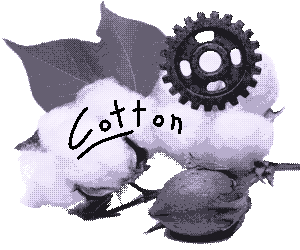

# cotton



cotton is a tiny virtual computer that lives in a window. it originally had a chip-8 emulator as a base but i ended up rewriting the vast, VAST majority of it to my liking. cotton is heavily inspired by [uxn](https://100r.co/site/uxn.html) and a little bit by [pico-8](https://www.lexaloffle.com/pico-8.php) (go check both projects out, they're awesome!!).

on cotton you write programs in `.cot` files using the cot programming language — a simple, straightforward, lua-esque language (that is being made alongside cotton's development) made FOR cotton.

## building cotton,

```
meson setup build
ninja -C build
```

(make sure you also have sdl installed or else windows wont open wawawaw!!)

## running cotton,

```
cotton <file.cot>
```

## the cot language

as i said on at the top of this file, cot is being developed alongside cotton and is meant to be small and straightforward, as of writting this (v0.1's release) these are the current features it has:

```
print "blah blah blah"   # prints text to the screen
wait                     # waits for x seconds
kill                     # exits cotton
color                    # colors text (there are 7 options, this will be doccumented later but you can also see it on cotton.h)

comments written as ' # '
```

i plan to focus more on cot itself for the next update so expect this list to grow some more by then :P

## tools

this is more so a thing for me, but, i figured i'd explain it:

you may notice there is a tools/ folder, in there you will find "eikimaker", a small program i made to help design the eiki font, i might expand on it at some point but for now it works just fine ^^

## docs

as of writting this (early stages of cotton v0.2) there is no doccumentation, however, i plan to add it either this or next update :) 

alot of what is said on this readme md file will prob end up being deleted in favour of being properly placed there xP

## cotton's mascot


this is cotton's mascot!! his name is ton!! he was drawn by me using cotton's colour palette!! say hi to ton!! :3

## credits

i'd like to thank [this guide](https://austinmorlan.com/posts/chip8_emulator/) for helping me figure out the initial base for cotton, even if 90% of it is gone by now, it helped me learn alot of stuff that i am now applying for cotton, awesome stuff ^^

i'd also like to thank [chld](https://srcdump.net/chld/) for making a C port of eikimaker.go AND currently working on a haiku backend for cotton - both arent merged to the repo yet but im still very grateful for both :)
