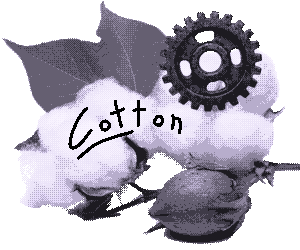

# cotton



cotton is a small stack machine for the cot programming language (a concatenative language inspired by Lua, Forth and Uxntal) written in C99

cotton is a passion hobby project being made solely by me, so, dont expect anything grandiose or of high quality - even then, suggestions and ideas are always welcome!! :D

## building cotton,

```
meson setup build
ninja -C build
```

## running cotton,

```
cotton <file.cot>
```

### docs,

doccumentation for (cot)ton can be found inside of the `docs` folder of the repo!! make sure you have `mandoc` so you can read them.,., or just,.. idk.,., read them RAW.,., you do you xP

as stated in the docs, since cotton still hasn't reached a stable release + knowing how i change my mind very easily, the language might be a bit unstable for it's first few releases and hence stuff might change quite a bit between releases, so, i'll try to keep the docs up-to-date with upmost priority so everything is properly doccumented :)

### "roadmap" for (cot)ton,

honestly i dont have a whole lot to put here for the time being as im afraid to set up goals too high for myself and end up not being able to achieve them, but, for now:

* Figure out what i wanna do with the syntax (kinda experimental atm [ ]
* Add more features to cot as it is somewhat barebones as of now [ ]
* Split(?) `interpreter.c` so as to keep everything tidy and organised [ ]
* HOPEFULLY and EVENTUALLY one day, some time soon(TM) figure out how to compile cot to uxntal [ ]

## misc but still related to the project:

### cotton's mascot,


this is cotton's mascot!! his name is ton!! he was drawn by me using old cotton's own colour palette!! say hi to ton!! :3

### wee bit of cotton history

cotton originally started as a slightly modified CHIP8 emulator, then was repurposed into being a fantasy computer inspired by [uxn](https://100r.co/site/uxn.html) but has ultimately ended up turning into what you're seeing right now :) - the old version of the project can be found on the 'old-cotton' branch of this repo, and, as you may be able to guess, its effectively dead and wont get updated anymore, being there purely for archival purposes (subject to change) xP
